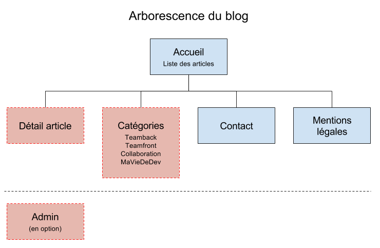

# Cahier des charges du blog

> Interprétation possible de la demande client.

## Contexte

### Présentation
Un responsable de formation d'une école de développement web souhaite mettre un blog à disposition de ses élèves.

### Objectif
Mettre à disposition un blog de développeurs souhaitant partager leur parcours lors de la formation O'clock... en réalité il s'agit d'un projet de blog standard à but pédagogique :nerd_face: ...

### Budget
A partir de 2000€ HT (soit 5 jours), réparti en :
- Gestion de projet (étude, cahier des charges, wireframes, suivi du dossier).
- Création des maquettes graphiques.
- Intégration HTML/CSS.
- Développement du blog.
- Tests et mise en ligne.

### Délai
Deux semaines à compter de la validation du devis (accompagné d'un acompte de 30%).

## Spécifications fonctionnelles

### Apparence
Ambiance "espace" (cosmos). Site responsive.
### Contenus
- des articles,
- des auteurs,
- des catégories (front, back, collaboration, vie du développeur).

Les contenus seraient créés à terme via une interface d'administration (à mettre en option, dans un premier temps nous vous fournirons les contenus).

### Interactions services
- Liens et/ou partages vers les réseaux sociaux.

### Langue
En français.

### Arborescence

- Accueil
- Page catégorie (articles filtrés par catégorie) :
    - Teamback
    - Teamfront
    - Collaboration
    - MaVieDeDev
- Page article (détail)
- (Contact)
- (Mentions légales)
- (Admin)

### Navigation

- Un menu principal vers les catégories et l'accueil
- En responsive, un menu burger apparait dans lequel se trouvent les liens
- On clique sur le titre ou le texte de l'article pour afficher le détail
- Un menu secondaire (dans le footer ou ailleurs) pour lier vers admin, contact, mentions légales.

### Templates

#### Layout global

- Un menu avec :
    - Titre/logo.
    - Liens vers les catégories.
- Une image d'en-tête avec titre + slogan (baseline).
- "Sidebar" à droite qui regroupe :
    - Champ de recherche.
    - Liste des catégories.
    - Liste des auteurs.
- Pied de page :
    - Liens vers les réseaux sociaux.
    - Liens vers admin, contact, mentions légales.

#### Liste des articles

- Un article :
    - Un titre (cliquable)
    - Un résumé (cliquable)
    - Date
    - Auteur
    - Catégorie
- Pagination "Précedente" et "Suivante".

### Contraintes techniques

- Site responsive.
- Compatibilité dernières versions des navigateurs (Chrome, Firefox, Microsoft Internet Explorer 11 et Edge).

## Spécifications techniques

### Architecture logicielle choisie

Le blog sera conçu via :

#### Côté front
- HTML5 : le code respectera une sémantique correcte.
- CSS : nous utiiserons CSS dans sa version 2 ou 3, pour rester compatible avec Internet Explorer 11. L'utilisation d'un framework pour le responsive est envisagé.
- Javascript : sera utilisé si besoin, avec parcimonie.

#### Côté back
- PHP : PHP7 sera utilisé. La classe PDO permettra d'accéder aux données MySQL
- MySQL : permettra de stocker nos données.

### Description des données

- Articles
  - Titre
  - Résumé
  - Date du publication
  - Nombre du vues
  - Auteur de l'article
  - Catégorie à laquelle appartient l'article
- Auteurs
  - Nom
  - Prénom
  - Image de profil
- Catégories
  - Intitulé
